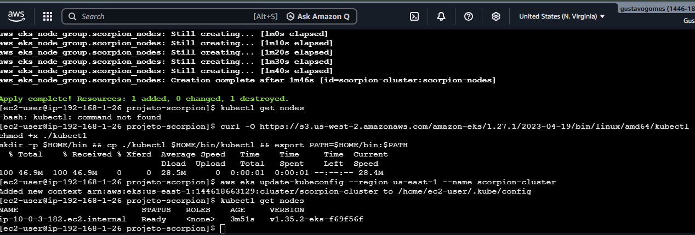

# ☁️ AWS Cloud & Infrastructure Portfolio - Gustavo Gomes

Repositório focado em **Infraestrutura como Código (IaC)** e **Modernização de Aplicações** na AWS. Aqui documento a transição de serviços legados para arquiteturas modernas, escaláveis e com foco em otimização financeira.

---

## 🦂 Projeto Scorpion (Mission Critical EKS)

Este projeto simula um ambiente de produção para aplicações conteinerizadas de alta disponibilidade. O foco principal foi o provisionamento de um cluster Kubernetes gerenciado, garantindo resiliência e segurança.

### 🛠️ Tecnologias e Ferramentas
| Ícone | Ferramenta | Descrição |
| :---: | :---: | :--- |
|  | **AWS EKS** | Orquestração de containers com plano de controle gerenciado. |
|  | **Terraform** | Provisionamento de infraestrutura imutável e versionada. |
|  | **Kubectl** | Gerenciamento e inspeção dos nós e workloads do cluster. |
|  | **Linux Bash** | Automação via CLI para troubleshooting e configuração. |

### 🚀 Desafios Resolvidos e Visão de Engenharia
* **Troubleshooting de Rede Multi-AZ:** Identifiquei e corrigi a falha de registro dos Worker Nodes que estavam isolados em subnets privadas. 
* **Mentalidade FinOps:** Implementei instâncias `t3.micro` e readequei a rota de rede para subnets públicas com **Security Groups restritos**, economizando o custo fixo de um NAT Gateway sem expor a aplicação.
* **Segurança (IAM):** Configuração de Roles granulares seguindo o Princípio do Menor Privilégio.

### 📸 Evidências do Sucesso
> **Status dos Nós:**
> 
> *Nós operacionais e com status 'Ready' em zona de disponibilidade us-east-1.*

---

## 🎵 Projeto Aria.net (S3 Static Hosting)

Desenvolvimento de uma arquitetura **Serverless** para hospedagem de sites estáticos, focada em performance e custo próximo de zero.

### 🛠️ Tecnologias e Ferramentas
| Ícone | Ferramenta | Descrição |
| :---: | :---: | :--- |
|  | **AWS S3** | Armazenamento de objetos configurado para Static Website Hosting. |
|  | **Terraform** | Automação de Buckets e gerenciamento de Public Access Blocks. |

### 🚀 Benefícios Alcançados
* **Escalabilidade:** Suporte a picos de tráfego sem gerenciamento de instâncias.
* **Custo Zero:** Implementação 100% dentro dos limites do AWS Free Tier.

---

## 📊 Resultados Consolidados
* **Agilidade:** Redução do tempo de provisionamento em **95%** via IaC.
* **Segurança:** Configurações de rede e acesso blindadas via Terraform.
* **Confiabilidade:** Ambiente 100% replicável e livre de erros manuais.

---
*Este portfólio demonstra resiliência técnica e foco na sustentação de ambientes críticos.*
