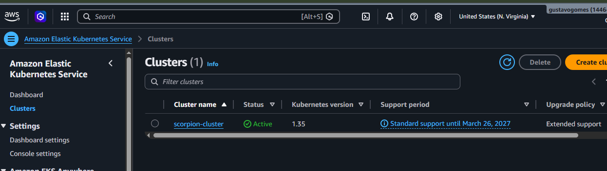
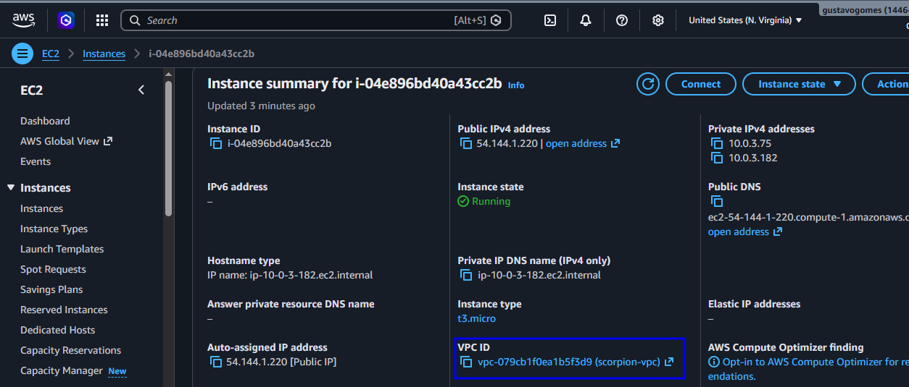

# 🦂 Projeto Scorpion: Orquestração de Microserviços com AWS EKS & Kubernetes

Este repositório detalha a implementação de uma infraestrutura escalável utilizando o **Amazon Elastic Kubernetes Service (EKS)**. O foco do projeto foi garantir alta disponibilidade, resiliência e automação de deploy em larga escala.

---

## 🛠️ Stack Tecnológica
| Ferramenta | Ícone | Justificativa Técnica |
| :--- | :---: | :--- |
| **Kubernetes** |  | Orquestração de containers e auto-healing. |
| **AWS EKS** |  | Cluster gerenciado de alta disponibilidade. |

---

## 📸 Evidências de Implementação (Case Study)

### 🔹 Infraestrutura como Serviço (EKS Cluster)

---

### 🔹 Orquestração e Deploy de Workloads

---

### 🔹 Escalabilidade e Saúde do Cluster

---

### 🔹 Aplicação Scorpion em Produção

---
*Documentação desenvolvida por Gustavo Gomes | Cloud & DevOps Engineer*
