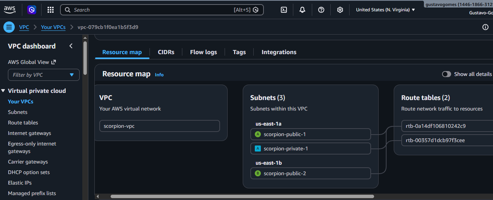
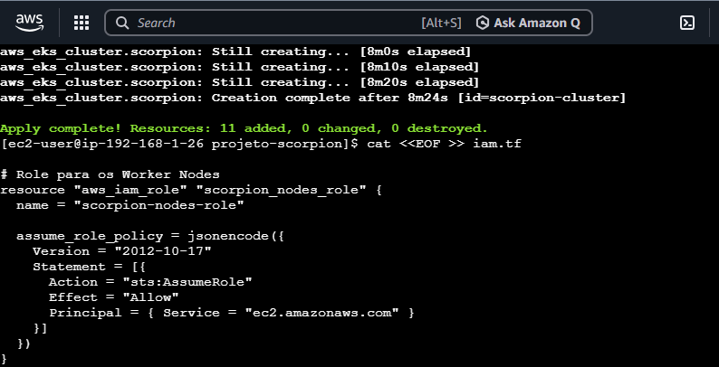
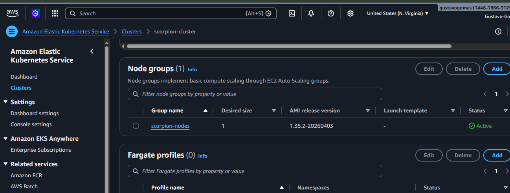

# ☁️ AWS Cloud & Infrastructure Portfolio - Gustavo Gomes

Repositório focado em **Infraestrutura como Código (IaC)** e **Modernização de Aplicações** na AWS. Aqui documento projetos reais de transição para arquiteturas escaláveis e otimizadas.

---

## 🦂 Projeto Scorpion (Mission Critical EKS Cluster)

Provisionamento de um cluster Kubernetes gerenciado (EKS) focado em alta disponibilidade e resiliência.

### 🛠️ Tecnologias
| Ferramenta | Nome | Descrição |
| :---: | :---: | :--- |
|  | **AWS EKS** | Orquestração de containers. |
|  | **Terraform** | IaC para VPC, IAM e EKS. |

### 📸 Galeria de Implementação (Scorpion)
* **Arquitetura de Rede:** 
* **Provisionamento:** 
* **Cluster Ativo:** 

---

## 🎵 Projeto Aria.net (S3 Static Hosting)

Este projeto foca na automação de hospedagem serverless de baixa latência e custo zero.

### 🛠️ Tecnologias
| Ferramenta | Nome | Descrição |
| :---: | :---: | :--- |
|  | **Amazon S3** | Hosting estático e armazenamento. |
|  | **Terraform** | Automação de Buckets e Policies. |

### 📸 Galeria de Implementação (Aria)

#### 🔹 Fase 1: Escopo e Planejamento IaC
Provisionamento inicial dos recursos de storage.
* **Terraform Init & Plan:** 
* **Definição de Recursos:** 

#### 🔹 Fase 2: Automação e Outputs
Configuração de variáveis e visualização de resultados.
* **Criação do Bucket:** 
* **Outputs de Endpoint:** 

#### 🔹 Fase 3: Segurança e Políticas de Acesso
Configuração de Bucket Policies para acesso público controlado.
* **Security Policy:** 
* **Bloqueio de Acesso Indevido:** 

#### 🔹 Fase 4: Validação e Deployment Final
Site publicado e funcional no endpoint da AWS.
* **Apply Finalizado:** 
* **Site Online:** 

### 🚀 Diferenciais Técnicos
* **FinOps:** Custo zero utilizando o AWS Free Tier.
* **Sustentação:** Infraestrutura imutável - qualquer alteração é feita via código, eliminando o "clique-ops".

---
*Este portfólio demonstra resiliência técnica e foco na sustentação de ambientes críticos.*
